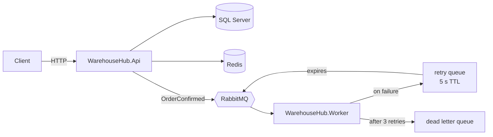

# WarehouseHub

An order and inventory management API built with **.NET 10**, following **Clean Architecture** and **CQRS**. It manages products and stock, processes orders with strict business rules, caches hot reads in **Redis**, and publishes domain events to **RabbitMQ**, where a separate worker service processes them with retries and a dead letter queue.

The project focuses on the problems real warehouse systems face: keeping stock consistent under concurrent orders, keeping a cache correct when data changes, and not losing messages when something fails.

## Features

- **Products and stock**: create products with unique SKUs, list and fetch them, receive new stock
- **Order lifecycle**: create orders as `Pending`, confirm them (stock is taken), cancel them (stock is returned)
- **Business rules in the domain**: stock can never go negative, only pending orders can change, an order cannot be confirmed twice
- **Concurrency protection**: two orders competing for the same stock cannot both succeed
- **Redis caching**: cache-aside reads with TTL and targeted invalidation on every stock change
- **Event-driven processing**: confirmed orders are published to RabbitMQ and handled by a worker with retry and dead letter queues
- **Consistent error responses**: all errors are returned as RFC 7807 `ProblemDetails` from a single global handler

## Architecture



### Projects

| Project | Responsibility |
| --- | --- |
| `WarehouseHub.Domain` | Entities and business rules (`Product`, `Order`, `OrderItem`). No dependencies. |
| `WarehouseHub.Application` | Use cases as CQRS commands and queries (MediatR), DTOs, interfaces for persistence, caching and messaging |
| `WarehouseHub.Infrastructure` | EF Core with SQL Server, Redis cache, RabbitMQ publisher |
| `WarehouseHub.Api` | ASP.NET Core controllers, global error handling, OpenAPI |
| `WarehouseHub.Contracts` | Message contracts shared between services |
| `WarehouseHub.Messaging` | RabbitMQ topology (exchange, queues, retry and dead letter setup) |
| `WarehouseHub.Worker` | Background service that consumes `OrderConfirmed` events |

Dependencies point inward: the Domain knows nothing about the database, and the Application layer depends only on interfaces. Switching SQL Server for another database would only touch Infrastructure.

## Design decisions

**Rich domain model.** Business rules live inside the entities, not in services. Setters are private, so the only way to change stock is through `IncreaseStock` / `DecreaseStock`, which enforce the rules every time. Order items copy the product's price at order time, so later price changes do not alter past orders.

**Stock is taken on confirmation, not creation.** Pending orders do not hold stock. Confirming an order updates the order status and the stock of every product in a single `SaveChanges` call, which EF Core runs in one transaction: either all items are reserved or none are.

**Optimistic concurrency.** `StockQuantity` is a concurrency token. If two requests confirm orders for the same product at the same time, the second save fails with `409 Conflict` instead of silently overwriting the first.

**Caching strategy.** Product reads use the cache-aside pattern. Every command that changes stock invalidates only the affected keys, and only after the database commit succeeds, so a concurrent read cannot put stale data back into the cache. TTLs act as a safety net if an invalidation is ever missed. If Redis is unavailable, requests fall back to the database instead of failing.

**Reliable messaging.** Queues are durable and messages are persistent, so they survive a broker restart. The API uses publisher confirms, so a publish completes only once RabbitMQ has stored the message. The worker acknowledges manually, so a message is removed only after it has been processed. Failed messages go to a retry queue with a 5 second TTL that routes them back to the main queue; after 3 failed attempts they move to a dead letter queue for inspection instead of blocking the queue or being lost.

**Known gap.** If the database commit succeeds but publishing to RabbitMQ fails, the event is lost (logged, but not retried). The fix is the transactional outbox pattern, listed in the roadmap below.

## Tech stack

.NET 10 · ASP.NET Core · EF Core 10 · SQL Server 2022 · Redis · RabbitMQ 4 · MediatR · xUnit · Docker · Docker Compose · Scalar (OpenAPI UI)

## Getting started

### Run everything with Docker

The only requirement is [Docker Desktop](https://www.docker.com/products/docker-desktop/).

```bash
git clone https://github.com/busrayalcinn/WarehouseHub.git
cd WarehouseHub
docker compose up -d --build
```

This starts SQL Server, Redis, RabbitMQ, the API and the worker. Containers wait for their dependencies to pass health checks, and the API applies database migrations on startup, so no manual setup is needed.

| What | URL |
| --- | --- |
| API reference (Scalar) | http://localhost:8080/scalar |
| RabbitMQ management | http://localhost:15672 (`warehouse` / `Warehouse_Passw0rd!`) |

Follow the worker's output with `docker compose logs -f worker`. Stop everything with `docker compose down` (add `-v` to also delete the data).

### Run locally for development

Requires the [.NET 10 SDK](https://dotnet.microsoft.com/download). Start only the infrastructure in Docker and run the services from source:

```bash
docker compose up -d sqlserver redis rabbitmq
dotnet run --project src/WarehouseHub.Api      # http://localhost:5116/scalar
dotnet run --project src/WarehouseHub.Worker   # in a second terminal
dotnet test                                    # run the unit tests
```

> **Note:** The credentials in `docker-compose.yml` and the `appsettings` files are local development defaults. In production they must come from environment variables or a secret store.

## API

| Method | Endpoint | Description |
| --- | --- | --- |
| `GET` | `/api/products` | List products (cached) |
| `GET` | `/api/products/{id}` | Get a product (cached) |
| `POST` | `/api/products` | Create a product |
| `POST` | `/api/products/{id}/stock` | Receive stock |
| `GET` | `/api/orders` | List orders |
| `GET` | `/api/orders/{id}` | Get an order with its items |
| `POST` | `/api/orders` | Create a pending order |
| `POST` | `/api/orders/{id}/confirm` | Confirm an order and reserve stock |
| `POST` | `/api/orders/{id}/cancel` | Cancel an order and return stock if it was confirmed |

### Try it

```bash
# Create a product
curl -X POST http://localhost:8080/api/products \
  -H "Content-Type: application/json" \
  -d '{ "sku": "kb-001", "name": "Mechanical Keyboard", "unitPrice": 1499.90, "initialStock": 25 }'

# Create an order (use the product id from the previous response)
curl -X POST http://localhost:8080/api/orders \
  -H "Content-Type: application/json" \
  -d '{ "customerName": "Ayse Demir", "items": [ { "productId": "<product-id>", "quantity": 3 } ] }'

# Confirm it: stock drops from 25 to 22 and the worker logs the shipment
curl -X POST http://localhost:8080/api/orders/<order-id>/confirm
```

To see the retry and dead letter flow, create and confirm an order whose `customerName` contains `fail`. The worker simulates a processing error, retries three times at 5 second intervals, then moves the message to `order-confirmed.dlq`, visible in the RabbitMQ management UI.

### Error responses

| Status | When |
| --- | --- |
| `400` | A business rule is violated (e.g. insufficient stock, negative price) |
| `404` | The product or order does not exist |
| `409` | Duplicate SKU, or a concurrent update to the same stock |

## Roadmap

- [x] Unit tests with xUnit for domain rules and handlers
- [x] Containerize the API and worker so the whole system starts with `docker compose up`
- [ ] Transactional outbox to guarantee event delivery
- [ ] Idempotent consumer using the message id
- [ ] Integration tests against a real SQL Server with Testcontainers
- [ ] CI pipeline with GitHub Actions

## Author

**Büşra Yalçın** · [GitHub](https://github.com/busrayalcinn) · [LinkedIn](https://linkedin.com/in/yalcinbusra)
